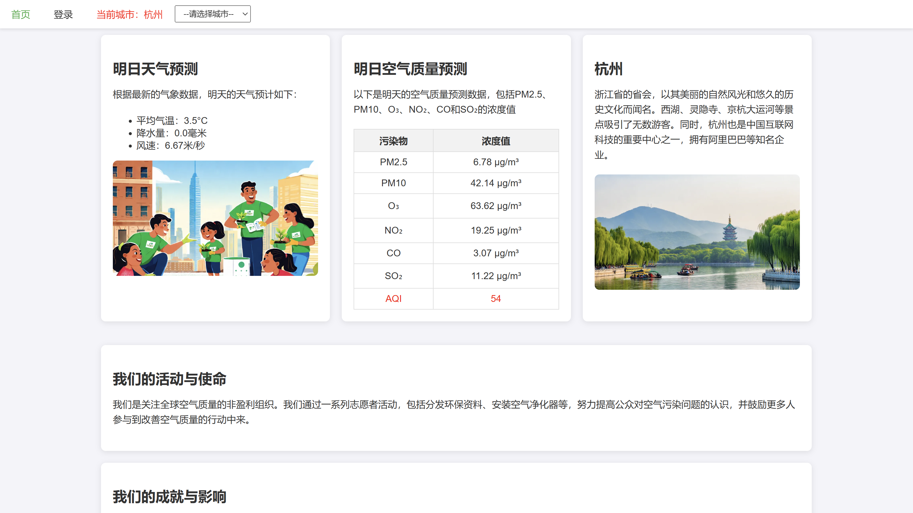

# air-quality
predict air quality
# design  
please view design.docx
# evaluate  
| 评测指标 | PM10   | PM2.5  | O3    | CO    | NO2   | SO2   |
|----------|--------|--------|-------|-------|-------|-------|
| 均方根误差 RMSE | 0.45  | 0.45  | 0.48  | 0.87  | 0.50  | 0.48  |
| 均方误差 MSE   | 0.21  | 0.20  | 0.23  | 0.75  | 0.26  | 0.23  |
| 平均绝对误差 MAE | 0.30  | 0.31  | 0.27  | 0.45  | 0.37  | 0.34  |
| 中位数绝对误差 MedAE | 0.21  | 0.22  | 0.15  | 0.22  | 0.27  | 0.24  |
| 有效数据量 | 2,724,629 | 2,904,370 | 1,664,952 | 986,575 | 2,426,410 | 1,211,543 |
# demo  

